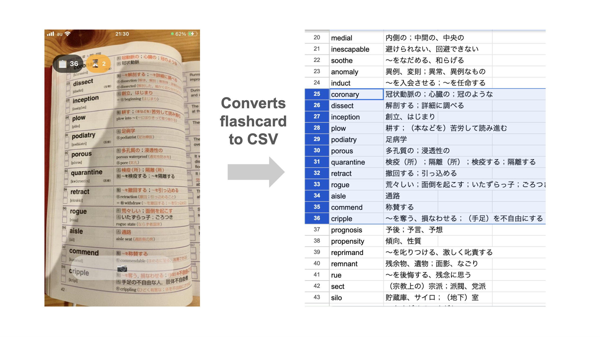

# Vocab2CSV

英単語帳のページを撮影することで、英単語と日本語訳のペア一覧をCSVファイルとして抽出できるアプリです。  
現在、このアプリはApp StoreやGoogle Playでは公開されていません。



## セットアップ方法

このアプリはReact Native/Expoで開発されています。

### 1. 開発環境のセットアップ

Expoの公式ドキュメントを参考に、iOSまたはAndroidの実機ビルドが可能な開発環境をセットアップしてください。

https://docs.expo.dev/get-started/set-up-your-environment/?mode=development-build&buildEnv=local

### 2. OpenAI APIの設定

このアプリはOpenAI APIを使用します。プロジェクトのルートに`.env.local`ファイルを作成し、OpenAIのAPIキーを設定してください。

```env
EXPO_PUBLIC_OPENAI_API_KEY=your_openai_api_key_here
```

### 3. アプリのビルド

以下のコマンドでアプリを実機ビルドします。

```bash
# iOSの場合
npx expo run:ios --configuration Release

# Androidの場合
npx expo run:android --variant release
```

## 使用方法

1. **📷ボタン**: タップするとページの読み取りを開始します。処理には時間がかかります。⌛️アイコンの横に処理中のページ数が表示されます。

2. **📋ボタン**: 読み取り済みの英単語と日本語訳のペア数が表示されます。このボタンをタップすると、読み取り済みの単語ペアをCSVファイルにエクスポートできます。
